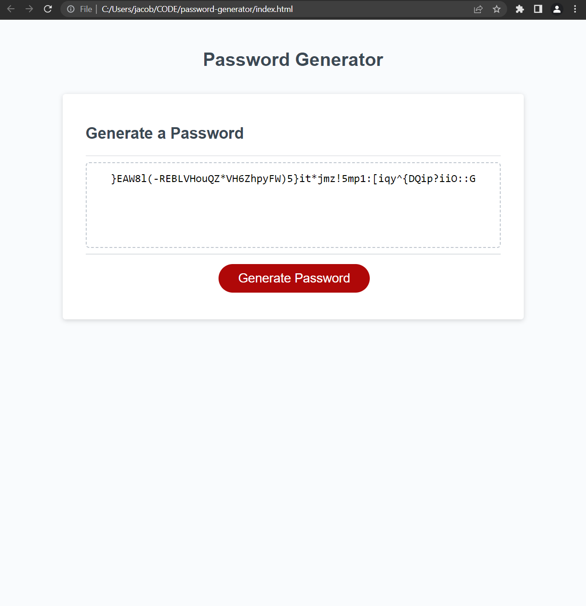

# Password-Generator

This website was designed to allow users to generate random passwords based on selected parameters. 

Here is a screenshot of the new page followed by the deployed link. 

[Site]jacobtillman.github.io/password-generator

## Original Task

This week's Challenge requires you to modify starter code to create an application that enables employees to generate random passwords based on criteria that they’ve selected. This app will run in the browser and will feature dynamically updated HTML and CSS powered by JavaScript code that you write. It will have a clean and polished, responsive user interface that adapts to multiple screen sizes.
